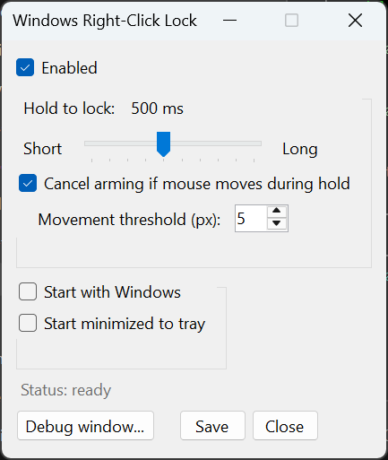
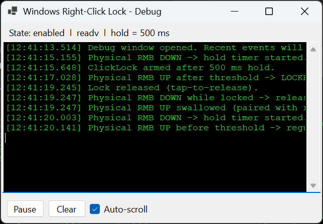

# Right-Click Lock for Windows

Reference implementation of a proposed native Windows feature. Extends Windows ClickLock to the right mouse button, addressing a longstanding asymmetry in the Mouse Properties Buttons tab.

**Quick links:** [Proposal for Microsoft](docs/proposal-right-click-lock.md) | [Technical white paper](docs/whitepaper.md) | [Security review](docs/security-review.md) | [Usage guide](docs/usage.md)

---

## Why this exists

Windows has shipped **ClickLock** since Windows 2000: tap and briefly hold the primary mouse button, release, and the OS continues to perceive the button as held until the next tap. There is no equivalent for the secondary (right) button. The asymmetry has a real user cost across three populations:

- **PC gamers.** Sustained right-click is the camera gesture across MMOs, ARPGs, RTS, city builders, sandbox titles, and flight sims. Hours of held RMB cause real discomfort.
- **Accessibility users.** ClickLock exists because button-locking helps users with limited grip strength. The same argument applies symmetrically to the right button.
- **Productivity users.** Right-button drag and prolonged context-menu interactions benefit from the same affordance.

This repository contains a working reference implementation of Right-Click Lock plus a formal proposal for Microsoft to absorb the feature into Mouse Properties and the modern Settings app.

## For Microsoft reviewers

If you are evaluating whether this should ship in Windows, start here:

1. **[docs/proposal-right-click-lock.md](docs/proposal-right-click-lock.md)** is the formal proposal: problem statement, UX mockup, implementation paths inside the OS input stack, risk analysis, success metrics, and license offer.
2. **[docs/whitepaper.md](docs/whitepaper.md)** documents the design rationale, the state machine, the crash-safety model, performance characteristics, and compatibility constraints. Useful as a test corpus for validating a native implementation.
3. **[docs/security-review.md](docs/security-review.md)** is an adversarial security audit with applied fixes. The reference implementation is held to a bar consistent with code that could ship in Windows.
4. **Run the reference implementation** to validate the UX and the move-cancel safety overlay against your own gesture set. The fastest path is to grab the signed `.exe` from [Releases](https://github.com/owenpkent/windows-right-click-lock/releases/latest); build instructions are also below.

The author offers a perpetual, royalty-free license to the reference implementation, whitepaper, and UX mockups for any native Windows implementation, with or without attribution. Contact details are at the end of the proposal document.

## What it does

Press and briefly hold the right mouse button. After a configurable threshold (default 500 ms), release. The right button stays "held" until you tap it again. Move-cancel mirrors Windows ClickLock semantics: cursor motion past a small dead-zone during the hold cancels the lock, so a press-and-drag remains a press-and-drag. Crash, session lock, and process exit all release the synthetic state via redundant defensive paths.

The full end-user walkthrough is in [docs/usage.md](docs/usage.md).

### Screenshots

| Settings window | Debug window |
| --- | --- |
|  |  |

The settings window exposes the hold-duration slider (Short to Long), the move-cancel safety overlay with its pixel threshold, autostart, and start-minimized. The debug window streams every relevant mouse event with millisecond timestamps and is useful for validating timing or comparing against a native implementation.

## Reference implementation

### Stack

- .NET 9 (`net9.0-windows`), WinForms.
- BCL only. No NuGet dependencies.
- Small layered codebase across Native, Hooks, Core, UI.
- Single-instance enforced via per-session named mutex with an explicit DACL scoped to the current user SID.
- System tray resident with idle and locked-state icons rendered at runtime.

### Download

Signed Windows builds are published on [Releases](https://github.com/owenpkent/windows-right-click-lock/releases/latest). The release asset is a single self-contained `.exe`, signed with the OK Studio Inc. EV code-signing certificate. No installer, no admin prompt, no .NET runtime install required: download, double-click, and the tray icon appears. The first launch extracts the bundled runtime to `%TEMP%\.net\` (one-time, takes a few seconds); subsequent launches are immediate.

Each release includes the SHA-256 of the asset in the release notes. To verify before running:

```powershell
Get-FileHash .\WindowsRightClickLock-0.1.1.exe -Algorithm SHA256
```

### Build

Requires the .NET 9 SDK on Windows 10 or 11. Install via winget:

```powershell
winget install Microsoft.DotNet.SDK.9
```

Then:

```powershell
dotnet build src/WindowsRightClickLock/WindowsRightClickLock.csproj -c Release
```

For a single-file publish:

```powershell
dotnet publish src/WindowsRightClickLock/WindowsRightClickLock.csproj `
  -c Release -r win-x64 --self-contained false -p:PublishSingleFile=true
```

The published `.exe` lands in `src/WindowsRightClickLock/bin/Release/net9.0-windows/win-x64/publish/`.

For a signed, self-contained release build (single `.exe` testers can run without installing the .NET runtime), use the release script. Run from a non-elevated PowerShell with the EV signing eToken plugged in:

```powershell
pwsh scripts/release.ps1            # build + sign, drops release/WindowsRightClickLock-<ver>.exe
pwsh scripts/release.ps1 -Tag       # also git-tags vX.Y.Z and creates a GitHub Release
```

### Run

Launch `WindowsRightClickLock.exe`. The settings window opens with sensible defaults. The tray icon turns red when the lock engages. Right-click the tray for the full menu. The full walkthrough is in [docs/usage.md](docs/usage.md).

## Architecture

```
windows-right-click-lock/
├── docs/
│   ├── proposal-right-click-lock.md   # Microsoft proposal
│   ├── whitepaper.md                  # design rationale
│   ├── usage.md                       # end-user guide
│   ├── security-review.md             # adversarial audit and fixes
│   └── mouse-properties-mockup.png    # UX mockup
├── src/WindowsRightClickLock/
│   ├── Native/        # P/Invoke, SendInput, structs
│   ├── Hooks/         # WH_MOUSE_LL wrapper with Suppress flag
│   ├── Core/          # state machine, settings, autostart
│   └── UI/            # tray context, settings form, live debug stream
└── scripts/
    ├── release.ps1                    # build + EV sign + (optional) GitHub Release
    ├── mockup-mouse-properties.ps1    # generator for the proposal mockup
    └── create-shortcut.ps1            # dev helper
```

Each layer depends only on the layers below. The Core layer has no UI dependency, so the state machine could be unit tested against a mock event source.

The hot path (the hook callback) is tight: no I/O, no blocking, and a single small per-event allocation handled comfortably by Gen-0 GC even at 1000 Hz mouse polling rates. The debug stream marshals to its own UI thread via `BeginInvoke` so observation never affects timing.

## Security posture

The implementation aims to meet a bar consistent with shipping native in Windows:

- Per-session named kernel objects (`Local\` namespace) with explicit DACLs scoped to the current user SID. Cross-session squatting and unauthenticated cross-session signaling are not possible.
- Crash-safe and session-safe synthetic state release via five redundant paths: `UnhandledException`, `ProcessExit`, `ApplicationExit`, `ThreadException`, and `SessionSwitch`.
- `SendInput` return value is checked. Held-state invariants are maintained even when the OS rejects an injection (e.g. UIPI block).
- Hook procedure exception isolation with rate-limited diagnostic logging to `%LocalAppData%\WindowsRightClickLock\hook-errors.log`.
- Atomic settings file writes via temp-then-rename.
- No telemetry. No network. No elevation requested.

The full adversarial audit, accepted risks, and applied fixes are in [docs/security-review.md](docs/security-review.md).

## Compatibility

- Windows 10 and 11, x64.
- Any game that consumes standard Windows mouse messages. Games that use Raw Input with `RIDEV_NOLEGACY` opt out of the legacy mouse-message path and the tool effectively does nothing for them, with no negative side effects.
- Synthesized input is detectable by anti-cheat systems. The reference implementation is intended for single-player and cooperative play. A native implementation in the OS input stack would not have this constraint.

## Why native is strictly better than this

A user-mode implementation will always carry constraints that a native one does not. This is the central argument for shipping the feature in Windows rather than leaving it to ISVs:

| Concern | User-mode (this implementation) | Native (proposed) |
|---|---|---|
| Anti-cheat compatibility | Routinely false-flagged | Built-in, exempt |
| Code signing and SmartScreen | Per-vendor cold-start | Trusted by default |
| Hook ordering disruption | Possible | Implemented at the input source |
| Per-app exclusion model | Each ISV reinvents | Inherits Focus Assist |
| Discoverability | Word of mouth | Mouse Properties and Settings |

## License and contact

This repository is released under the [MIT License](LICENSE) for general use. Separately, the author offers a perpetual, royalty-free license to use any portion of this repository (source, documentation, mockups) in a native Windows implementation, with or without attribution.

To report a security issue, see [SECURITY.md](SECURITY.md).

- **Author:** Owen Kent
- **LinkedIn:** [linkedin.com/in/owenpkent](https://www.linkedin.com/in/owenpkent/)
- **Project:** [github.com/owenpkent/windows-right-click-lock](https://github.com/owenpkent/windows-right-click-lock)
