# Windows Mouse Mods — Technical White Paper

**Version:** 0.1
**Audience:** Developers and technically-curious users who want to understand how the tool works under the hood.

## Abstract

Windows ships an accessibility feature called *ClickLock*, which lets the user hold a left-mouse-button click without keeping the button physically depressed. ClickLock has no equivalent for the right mouse button, despite many games (MMOs, ARPGs, RTS, builder/sandbox titles) requiring sustained right-click for camera control. **Windows Mouse Mods** fills that gap with a small tray-resident utility that implements RMB ClickLock plus the operational safety controls a long-running input-injection tool needs: crash-safe release, single-instance focus, atomic settings, and session-aware lock dismissal.

This document describes the design, the state machine, the safety invariants, and the trade-offs.

---

## 1. Problem statement

Sustained right-click is the de-facto camera gesture in a wide swath of PC games. After a few hours of play, the static muscle load on the index/middle finger is unpleasant and, for some users, injurious. The desired behavior is *exactly* what Windows ClickLock provides for the left button:

- Tap and briefly hold the button.
- After a configurable threshold, releasing the button leaves the OS believing the button is still held.
- The next tap of the same button releases the synthetic hold.

The Windows ClickLock implementation is hard-coded for the primary button. There is no public API to extend it to the secondary button, and no Group Policy / registry knob switches it. The remaining options are user-mode software:

- **AutoHotkey scripts** — work, but distribution is awkward and the script must be running with appropriate privileges.
- **Game-specific rebinds** — only when a game exposes "toggle camera" as a separate input.
- **Bespoke utilities** — what this project is.

## 2. Approach

The tool installs a global, low-level mouse hook (`WH_MOUSE_LL`) and uses two facts about Windows input plumbing:

1. **Hook callbacks can drop events.** Returning a non-zero value from a `WH_MOUSE_LL` procedure prevents the message from reaching downstream applications. Drop the natural `WM_RBUTTONUP` and the OS continues to perceive RMB as held.
2. **Synthetic events can be tagged.** `SendInput` accepts a `dwExtraInfo` field on each `MOUSEINPUT`. Setting a magic value lets the same hook callback identify and ignore events the tool itself injected, avoiding feedback loops.

With those two primitives, the core ClickLock behavior is a 5-state machine plus a safety overlay.

## 3. Architecture

The codebase is layered bottom-up:

```
Native    — P/Invoke surface, MOUSEINPUT injection, magic-tag constant
Hooks     — object wrappers for WH_MOUSE_LL with Suppress-flag events
Core      — pure logic: state machine, settings, autostart, crash flag
UI        — TrayApplicationContext, MainForm (settings), DebugForm (live)
```

Each layer has a single responsibility and depends only on the layers below it. The Core layer has no UI dependency, so the state machine could in principle be unit-tested against a mock event source — that is intentional but not currently exercised.

The application runs on the WinForms message loop. The `WH_MOUSE_LL` callback is invoked on the same thread as the message loop, which is the UI thread, so there is no cross-thread synchronization in the hot path. The DebugForm marshals to itself via `BeginInvoke` because it consumes hook events but lives in its own form lifecycle.

## 4. State machine

States during a single hold cycle:

```mermaid
stateDiagram-v2
    [*] --> Idle
    Idle --> Holding: RMB DOWN (physical)
    Holding --> Holding: MOUSEMOVE within threshold
    Holding --> MoveCancelled: MOUSEMOVE past threshold
    Holding --> Armed: hold timer fires
    MoveCancelled --> Idle: RMB UP (passes through)
    Armed --> Locked: RMB UP (UP suppressed)
    Locked --> Releasing: next physical RMB DOWN
    Releasing --> Idle: synthetic RMB UP fires; physical UP swallowed
```



Concrete code paths:

- `Idle → Holding` — `HandlePhysicalRmbDown` records cursor position, starts the hold timer.
- `Holding → MoveCancelled` — `HandlePhysicalMove` computes squared distance from the down position; if it exceeds `MoveCancelPixels²`, stops the timer and sets `_moveCancelled = true`.
- `Holding → Armed` — the `WinForms.Timer` fires; `_clickLockArmed = true` if the user is still holding.
- `Armed → Locked` — `HandlePhysicalRmbUp` sees `_clickLockArmed == true`, suppresses the UP, sets `_locked = true`, marks the held flag.
- `Locked → Releasing` — `HandlePhysicalRmbDown` sees `_locked == true`, suppresses the DOWN, queues "swallow next UP", injects synthetic UP.
- `Releasing → Idle` — the next physical UP arrives, is swallowed, state cleared.

The same exit paths are taken if the user toggles "Enabled" off, the workstation is locked (`SessionSwitch`), or the process is exiting.

## 5. Implementation specifics

### 5.1 Self-injection tag

Without a tag, the hook would observe its own `SendInput` calls and act on them, producing immediate feedback. Every `MOUSEINPUT` issued by `InputInjector.SendMouseFlag` sets:

```csharp
dwExtraInfo = NativeMethods.InjectionTag; // 'WINM' = 0x57494E4D
```

The hook's first check on every event is whether `MSLLHOOKSTRUCT.dwExtraInfo` matches the tag and skips the event entirely if so.

A magic constant is sufficient because the only injectors of interest are this process and the user. Other tools (other AHK scripts, accessibility software) can collide, but the consequence is benign — at worst we ignore one of their events as if it were ours.

### 5.2 Hook callback delegate lifetime

`SetWindowsHookEx` stores a function pointer to the supplied delegate. The CLR can collect the delegate if no managed reference holds it, after which the hook will trap and the application will crash. The mitigation is mechanical: each hook wrapper keeps the delegate in an instance field for the hook's lifetime.

```csharp
public LowLevelMouseHook()
{
    _proc = HookCallback; // bound once, kept alive while the wrapper lives
}
```

This is the most common bug in low-level-hook code. It surfaces only after a GC, so it is easy to ship and hard to reproduce locally.

### 5.3 Hook procedure exception isolation

If an unhandled exception escapes a low-level hook procedure, Windows silently unhooks the procedure. The user observes "the app stopped working" with no error and no recourse other than a restart. The wrapper handles this with a defensive `try/catch` that swallows everything inside the procedure — we cannot meaningfully report an error from the hook thread, and continuing without observation is worse than continuing with a missed event.

### 5.4 Move-cancel rationale

Real Windows ClickLock cancels arming if the cursor moves during the hold. Without this, a press-and-drag (e.g., a right-click drag-select in a game inventory) becomes a sticky lock — disorienting and a non-starter for daily use. The implementation:

- Cursor position at RMB DOWN is captured from `MSLLHOOKSTRUCT.pt` (already in screen coordinates).
- On every `WM_MOUSEMOVE` while the hold timer is running and not yet armed, we compute `dx² + dy²` and compare to `threshold²`.
- Comparing squared distances avoids `sqrt` per move event.
- Once cancelled, `_moveCancelled = true` short-circuits subsequent computations within the same hold; the flag clears on the next `RBUTTONDOWN`.
- Once armed, motion no longer cancels — matches Windows ClickLock semantics and avoids "I locked it then moved 6 px and lost the lock" surprises.

## 6. Crash safety

### 6.1 The "stuck button" problem

The tool's superpower — convincing the OS that RMB is held when it is not physically depressed — is also its sharpest hazard. If the process crashes or is force-killed while in `Locked`, the OS retains its belief that RMB is held until the user manually clicks. In a full-screen game, that can mean the camera spinning continuously until the user alt-tabs and clicks somewhere safe.

### 6.2 Defenses

The tool installs four redundant emergency-release paths:

| Trigger | Surface |
| --- | --- |
| `AppDomain.UnhandledException` | Generic .NET unhandled exception |
| `AppDomain.ProcessExit` | Cooperative process termination |
| `Application.ApplicationExit` | WinForms message loop ending |
| `Application.ThreadException` | UI-thread exceptions caught by WinForms |

All four call `InputInjector.EmergencyRelease`, which checks an atomic `_heldFlag` and fires `SendInput(MOUSEEVENTF_RIGHTUP)` only if the OS is believed to be holding the button. The flag is a `Volatile.Read/Write` `int` — appropriate for a single-bit signal across threads (the listener thread, the hook thread, the UI thread, and the GC finalizer thread can all observe it).

`SystemEvents.SessionSwitch` adds a fifth path: when Windows locks (`Win+L`) or the user logs off, we release explicitly so the user does not return from the lock screen with a synthetically-held button.

The hook procedure's `try/catch` wrapper closes a sixth gap: an exception that previously would have removed the hook (and stranded the user with the lock active) is now isolated and observation continues.

## 7. Single-instance signaling

Two concerns: detection and communication.

- **Detection** is a named `Mutex` (`Global\WindowsMouseMods.SingleInstance`). The first instance owns it; subsequent launches see `createdNew == false`.
- **Communication** is a named `EventWaitHandle` (`Global\WindowsMouseMods.Show`). The owning instance creates it and runs a background thread that waits on it. A second launch opens it via `TryOpenExisting`, calls `Set`, and exits with code 0. The background thread wakes, posts a callback to a captured `WindowsFormsSynchronizationContext`, and the UI thread shows the settings window.

This pattern avoids:

- Polling
- Marshaled COM activation
- Window-message broadcasts (`HWND_BROADCAST` works but requires a registered message id and a hidden window)
- Named pipes (more code, more lifecycle to manage)

For a single boolean cross-process signal, an event handle is the cheapest option that still composes cleanly with the WinForms message loop.

## 8. Atomic settings persistence

`AppSettings.Save` writes to `settings.json.tmp` and then calls `File.Move(tmp, settings.json, overwrite: true)`. NTFS `MoveFileEx`-style replacement is atomic with respect to readers — partial writes are no longer visible. The clamp pass on load (`ClampInPlace`) bounds `ClickLockHoldMs` and `MoveCancelPixels` into sane ranges, so a hand-edited or migrated file cannot push out-of-range values into the UI or controller.

A `.bak` rotation policy was considered and skipped — corrupt JSON falls back to defaults silently, and the user can always re-set values from the settings UI.

## 9. Performance

The hook callback runs on every mouse event the system observes, including every move pixel. The cost budget is therefore *very* tight. The current path:

1. `Marshal.PtrToStructure<MSLLHOOKSTRUCT>` (one stack copy of a small struct).
2. Allocate a `MouseHookEventArgs` (one small heap object per event).
3. Invoke a multicast delegate (currently with one subscriber).
4. The controller's switch on message id does at most one cheap distance computation on `WM_MOUSEMOVE` while the hold is active.

The single allocation per event is the main cost. On a 1000 Hz mouse, that is up to 1000 small objects/sec, easily handled by Gen-0 GC. If profiling ever shows GC pressure, the wrapper can switch to a `ref struct` event args (no heap allocation) or filter messages before allocating. Neither has been needed in practice.

The DebugForm subscribes to a separate `DebugMessage` string event and marshals to its own UI thread via `BeginInvoke`, so the hook thread is never blocked on rendering.

## 10. Compatibility

- **Operating systems:** Windows 10 and 11. The manifest declares both. Earlier OS versions are out of scope.
- **Bitness:** AnyCPU build runs as x64 on a 64-bit OS. 32-bit games still receive the synthesized RMB events because `SendInput` operates at the OS-input layer, not the process address space. Hooks installed by a 64-bit process cover 64-bit processes only, which is fine for modern games but means a 32-bit DirectX game would not see hook-suppressed events from a 64-bit instance — in practice every shipping game is 64-bit, so this is rarely relevant.
- **Games:** Any game that consumes standard Windows mouse messages works. Games that use Raw Input with `RIDEV_NOLEGACY` (i.e. opt out of WM_MOUSE messages entirely) bypass the suppression mechanism — for those, this tool effectively does nothing, with no negative side effects.
- **Anti-cheat:** Synthesized input is detectable. This tool is intended for single-player and cooperative play. Using it in environments where automation is disallowed is the user's responsibility.

## 11. Limitations

- No per-process rules; the tool is global.
- No panic hotkey (planned, not implemented).
- No support for additional mouse buttons (`XButton1`/`XButton2`).
- No installer; the executable is run in place.
- No telemetry, by design — but also no diagnostics in the field other than the live debug window.

## 12. Future work

Concrete additions on the roadmap, ordered by current usefulness:

1. **Panic hotkey** — system-wide key (e.g. `Ctrl+Alt+R`) that force-releases regardless of state.
2. **GitHub Release artifact** — workflow that publishes a single-file `.exe` on tag push.
3. **Per-process allowlist/blocklist** — only auto-engage in selected foreground processes.
4. **Optional file logging** — persistent debug output for after-the-fact diagnosis.

## References

1. Microsoft Learn, *SetWindowsHookExW function (winuser.h).*
2. Microsoft Learn, *SendInput function (winuser.h).*
3. Microsoft Learn, *MSLLHOOKSTRUCT structure.*
4. Microsoft Learn, *Mouse Properties: ClickLock.*
5. Raymond Chen, *The Old New Thing — keeping a hook delegate alive.*
